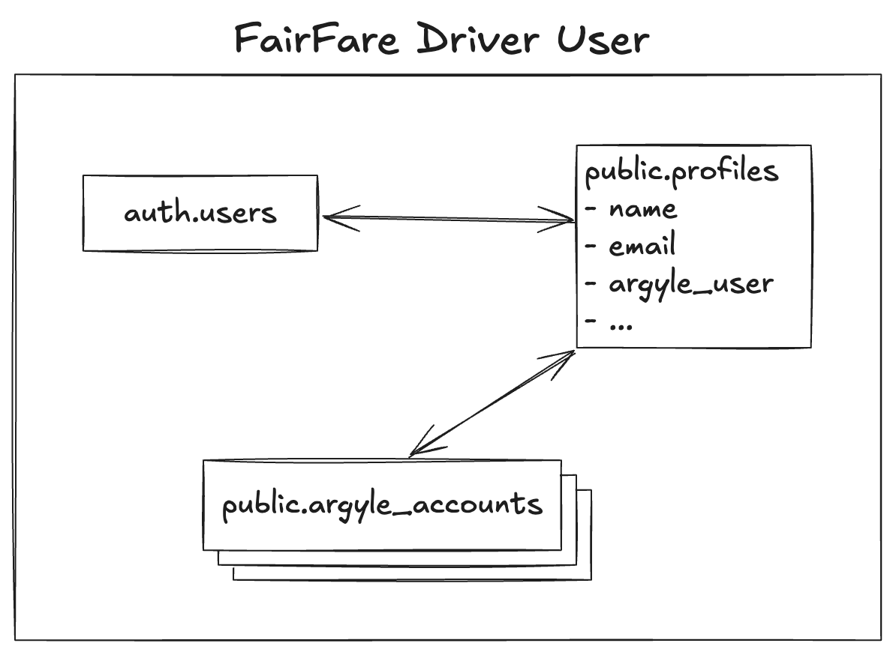

# Sample System

## Developing

Install Node.js version 18. More recent versions may not work.

```commandline
nvm install v18.20.4
nvm use v18.20.4
```

Install the dependenties and run the development server:

```bash
pnpm install

pnpm dev

# or start the server and open the app in a new browser tab
pnpm dev -- --open
```

Copy the `.env.example` file and complete the placeholder environment variables.

### IDE selection

We strongly suggest using VS Code as your IDE. Recommended extensions include:

- Svelte for VS Code
- i18n Ally
- Prettier
- ESLint

### Creating a production build

```bash
# Build the production site
pnpm build

# Preview the production site
pnpm preview
```

### Code style and format

We use Prettier for formatting and eslint for linting. We also use `svelte-check`
to check for other code hygeine issues. ([More info](https://svelte.dev/docs/cli/sv-check))

```bash
# Run the linter
pnpm lint:fix

# Run the formatter
pnpm format:fix

# Run svelte-check
pnpm check
```

### Supabase

We use Supabase as our [database](https://supabase.com/docs/guides/database/overview) and [authentication](https://supabase.com/docs/guides/auth) platform.

#### Common database commands

```bash
# Reset the database
npx supabase db reset


# Seed the database with seeds for the organizer feature.
# Ensure .env file is in the pwd before running this.
node --loader ts-node/esm data-migrations/seedDatabase.ts

# Generate TypeScript types based on the databsase schema
npx supabase gen types typescript --local > src/lib/schema.ts
```

#### Using SMS auth

We configure several testing phone numbers for SMS one time passwords (OTPs):

- Phone: 12223334444, OTP: 555555
- Phone: 18009000010, OTP: 808181
- Phone: 18009000020, OTP: 808282
- Phone: 18009000030, OTP: 808383

These OTPs will always work for logging in with these phone numbers.

The 12223334444 number is configured for the organizer login. The 1800 numbers
correspond to the profiles in the [Argyle sandbox](https://docs.argyle.com/overview/sandbox-testing), which can be used for testing the driver login.

## Testing

We use playwright for e2e tests. Run them with `pnpm run test:e2e`.

We use [vitest](https://vitest.dev/) for unit tests.
Run them with `pnpm run test`.

## Internationalization

Note that for pluralization we require this syntax:

```
$_('key.id', {values: {foo: bar})
```

## Cleanup

We can use `npx svelte-check` to check for unused imports and variables,
a11y issues, and other common problems.

## Argyle users, Supabase users, and Argyle accounts

The user representation in our database looks like the following:



- **auth.users** is a table controlled by Supabase for auth, and
  includes, e.g., a `user_id` and a hashed password if applicable.
- **public.profiles** maps 1:1 to auth.users and contains user profile
  information, e.g., their name and email and argyle_user ID. See [Argyle Documentation](https://docs.argyle.com/overview/data-structure/users)
- **public.argyle_accounts** maps many:1 to public.profiles and contains
  information about a user's connected account. See [Argyle Documentation](https://docs.argyle.com/overview/data-structure/accounts)
